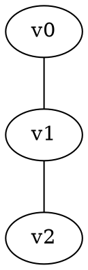

# Exo1 — Processador de Grafos Não Direcionados

## Descrição Geral

Este projeto consiste na implementação, em linguagem C, de um processador de grafos não direcionados baseado em listas de adjacência. O programa realiza a leitura de um ficheiro contendo arestas, constrói a estrutura do grafo em memória e executa diferentes análises estruturais e estatísticas sobre o mesmo.

Entre as funcionalidades implementadas destacam-se:

* leitura robusta de ficheiros de arestas;
* construção dinâmica do grafo;
* cálculo de graus mínimo e máximo;
* deteção de multigrafos e laços;
* identificação de componentes conexos;
* verificação de bipartição do grafo;
* exportação opcional para o formato DOT (Graphviz).

O projeto foi desenvolvido com foco em:

* eficiência;
* modularidade;
* tolerância a erros de entrada;
* compatibilidade multiplataforma.

---

# Estrutura Geral do Projeto

| Ficheiro   | Descrição                                                                                                        |
| ---------- | ---------------------------------------------------------------------------------------------------------------- |
| `main.c`   | Responsável pela interface principal do programa, leitura do ficheiro, parsing das linhas e geração do relatório |
| `graph.c`  | Implementação da estrutura do grafo e dos algoritmos de análise                                                  |
| `graph.h`  | Definição da API pública e das estruturas utilizadas                                                             |
| `Makefile` | Automatização da compilação e execução dos testes                                                                |
| `tests/`   | Conjunto de casos de teste                                                                                       |

---

# Compilação

## Utilizando Makefile

Na diretoria do projeto:

```bash
make
```

---

## Compilação Manual

```bash
gcc -Wall -Wextra -O2 -std=c99 -o program main.c graph.c
```

No Windows com MSYS2/MinGW o mesmo comando pode ser utilizado, produzindo `program.exe`.

---

# Execução

```bash
./program arquivo.csv
```

Exemplo:

```bash
./program tests/case1_simple.csv
```

---

# Formato do Ficheiro de Entrada

O ficheiro de entrada representa um conjunto de arestas de um grafo não direcionado.

Cada linha válida deve conter exatamente dois identificadores inteiros de vértices.

São aceites os seguintes formatos:

| Formato                | Exemplo   |
| ---------------------- | --------- |
| Separado por vírgula   | `10,20`   |
| Vírgula com espaços    | `10 , 20` |
| Separado por espaços   | `10 20`   |
| Separado por tabulação | `10\t20`  |

Linhas vazias ou compostas apenas por espaços em branco são ignoradas automaticamente.

---

# Tratamento de Linhas Inválidas

Caso uma linha não contenha exatamente dois inteiros válidos, o programa:

* ignora a linha;
* emite um aviso em `stderr`;
* continua o processamento do ficheiro.

Exemplo de mensagem:

```text
dados.csv:53: malformed edge skipped: "texto inválido"
```

Esta abordagem garante maior robustez perante ficheiros inconsistentes ou parcialmente corrompidos.

---

# Tratamento de Erros Graves

A execução é interrompida nos seguintes casos:

* falha ao abrir o ficheiro;
* erro de leitura do sistema (`ferror`);
* linhas superiores ao tamanho máximo suportado pelo buffer interno;
* falhas críticas de memória.

Nestes casos, o programa termina sem gerar o relatório final completo.

---

# Estrutura Interna do Grafo

O grafo é armazenado através de listas de adjacência dinâmicas.

## Representação dos vértices

Os identificadores originais presentes no ficheiro são convertidos internamente para índices compactos:

```text
0 ... N-1
```

Esta conversão é realizada através de tabelas hash, permitindo:

* inserção eficiente;
* procura rápida;
* economia de memória.

---

# Funcionalidades Implementadas

# 1. Construção do Grafo

Cada aresta válida é adicionada em ambas as listas de adjacência:

```text
u -> v
v -> u
```

garantindo a representação correta de um grafo não direcionado.

---

# 2. Estatísticas Básicas

O programa apresenta:

* número total de vértices distintos;
* número total de arestas válidas lidas.

Exemplo:

```text
Vertices: 999
Edges: 996
```

---

# 3. Cálculo de Graus

Para cada vértice é calculado o tamanho da sua lista de adjacência.

O relatório apresenta:

* grau mínimo;
* grau máximo.

Exemplo:

```text
Min degree: 1
Max degree: 3
```

---

# 4. Deteção de Multigrafos

O sistema identifica:

## Laços (loops)

Arestas da forma:

```text
u = v
```

## Arestas múltiplas

Mais do que uma ocorrência do mesmo par de vértices.

Com base nisso, o programa classifica o grafo como:

* `Simple`
* `Multigraph`

Exemplo:

```text
Graph type: Simple
Loops: 0
Multiple edges: 0
```

---

# 5. Componentes Conexos

A identificação de componentes conexos é realizada através de pesquisa em profundidade (DFS).

O programa determina:

* número total de componentes;
* tamanho de cada componente.

Exemplo:

```text
Connected components: 4
Component sizes: [249, 250, 250, 250]
```

---

# 6. Verificação de Bipartição

A função `graph_is_bipartite` utiliza coloração em largura (BFS) para verificar se o grafo é bipartido.

Um grafo é considerado bipartido quando é possível dividir os vértices em dois conjuntos disjuntos sem que existam arestas entre vértices do mesmo conjunto.

O algoritmo:

* utiliza duas cores;
* verifica conflitos de coloração;
* rejeita automaticamente grafos com laços.

Saídas possíveis:

| Resultado         | Significado                              |
| ----------------- | ---------------------------------------- |
| `yes`             | grafo bipartido                          |
| `no`              | grafo não bipartido                      |
| `unknown (error)` | falha de memória durante o processamento |

---

# Exportação para Graphviz (Formato DOT)

Após o processamento bem-sucedido do ficheiro, o programa gera automaticamente:

```text
graph_export.dot
```

Este ficheiro pode ser utilizado pelo Graphviz para gerar representações visuais do grafo.

---

# Estrutura do Ficheiro DOT

O grafo é exportado no formato:



Características da exportação:

* utilização de `graph` para grafos não direcionados;
* arestas representadas por `--`;
* nós rotulados com os identificadores originais;
* prevenção de duplicação de arestas em grafos simples.

---

# Geração de Imagens com Graphviz

Após instalar o Graphviz:

[Graphviz](https://graphviz.org/?utm_source=chatgpt.com)

podem ser utilizados os seguintes comandos:

## PNG

```bash
dot -Tpng graph_export.dot -o graph.png
```

## SVG

```bash
dot -Tsvg graph_export.dot -o graph.svg
```

## PDF

```bash
dot -Tpdf graph_export.dot -o graph.pdf
```

---

# Saídas do Programa

## Stdout

O relatório principal é escrito utilizando `stdout`:

* estatísticas;
* análise estrutural;
* propriedades do grafo.

---

## Stderr

Mensagens auxiliares e avisos são enviados para `stderr`:

* linhas inválidas;
* erros de leitura;
* falhas de exportação.

---

# Redirecionamento de Saída

## Guardar relatório

```bash
./program dados.csv > relatorio.txt
```

## Guardar avisos separadamente

```bash
./program dados.csv > relatorio.txt 2> avisos.txt
```

---

# Considerações Técnicas

O projeto foi desenvolvido seguindo princípios de:

* modularidade;
* separação de responsabilidades;
* tolerância a erros;
* eficiência de acesso;
* gestão dinâmica de memória.

A utilização de:

* listas de adjacência;
* tabelas hash;
* DFS;
* BFS;

permite que o sistema processe grafos de dimensão considerável de forma eficiente.

---

# Possíveis Extensões Futuras

A arquitetura atual permite a implementação futura de:

* grafos direcionados;
* grafos ponderados;
* algoritmos de caminhos mínimos;
* deteção de ciclos;
* árvores geradoras;
* exportação para outros formatos;
* análise de centralidade;
* algoritmos de fluxo.
